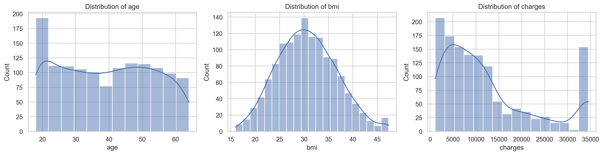
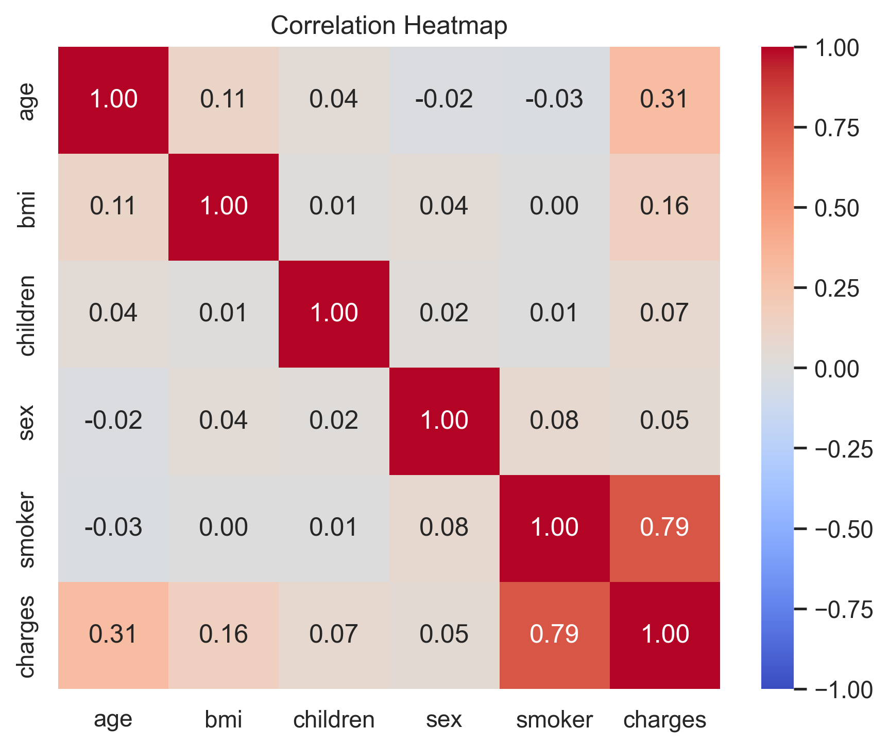
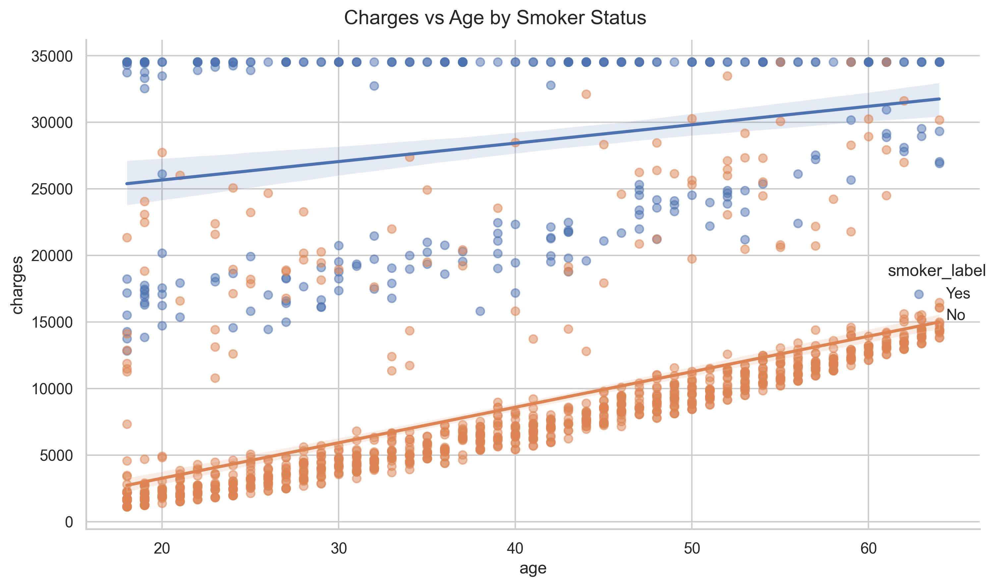
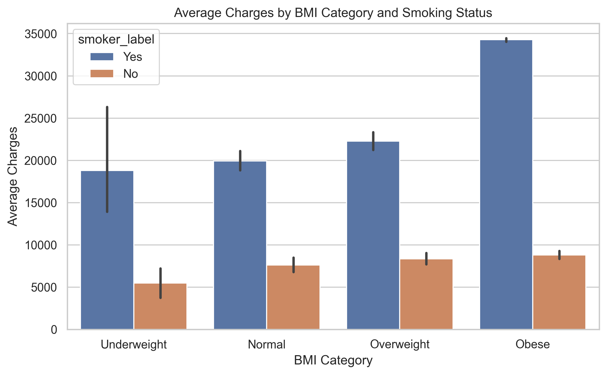
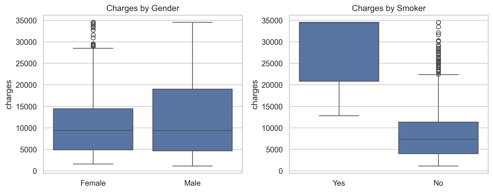
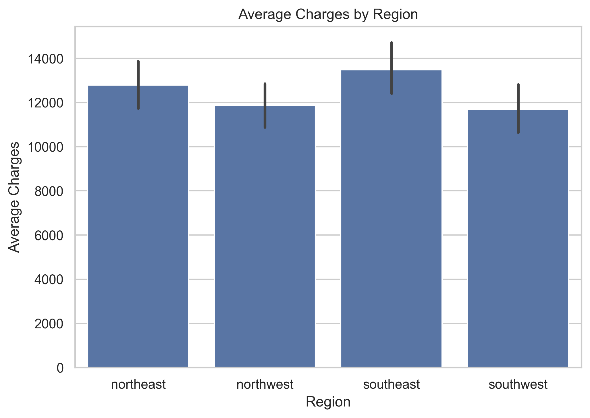

Medical Insurance Cost Prediction

End-to-end ML workflow to predict individual medical insurance charges from demographic and lifestyle features. Includes data cleaning utilities, EDA, multiple models, evaluation, and a simple prediction CLI.

Structure
- data/: insurance.csv, insurance_cleaned.csv
- notebooks/: 01_cleaning_data.ipynb, 02_eda.ipynb
- src/: data_cleaning.py, baseline.py, tree.py, xgboost.py, evaluate.py, train.py, predict.py
- models/: saved pipelines and metrics
- reports/: figures and PDF report

Setup
- Python 3.10+ recommended
- Create venv (optional) and install deps:
  - Windows: python -m venv .venv; .\.venv\Scripts\Activate.ps1
  - Unix/macOS: python -m venv .venv && source .venv/bin/activate
  - Install: pip install -r requirements.txt
  - Optional XGBoost: pip install xgboost

Clean data (programmatic)
```python
import pandas as pd
from src.data_cleaning import DataCleaning
df = pd.read_csv("data/insurance.csv")
clean_df = (DataCleaning(df)
  .canonicalize_text().remove_duplicates().validate_schema()
  .fill_categorical_mode().fill_numerical_median(group_cols=["sex","smoker","region"]).handle_outliers_iqr(columns=["bmi","charges"]) 
  .encode_label(["sex","smoker"]).encode_one_hot(["region"]).get_cleaned_data())
clean_df.to_csv("data/insurance_cleaned.csv", index=False)
```

Train
```bash
python -m src.train
```
Saves: models/<Name>.joblib, models/best_model.joblib, models/all_models_results.json, models/best_model.json

Predict
```bash
python -m src.predict --input data/insurance_cleaned.csv --output predictions.csv
```
Optional: `--model models/RandomForest.joblib`

Results (held-out)
- Best: RandomForest - RMSE 4228.69, MAE 2242.10, R2 0.8470
- Full metrics: models/all_models_results.json

EDA & Report
- Notebook: notebooks/02_eda.ipynb
- Figures: reports/figures/
- PDF: reports/Medical_Insurance_Cost_Prediction_Report.pdf

Author
- Hasti Aksoy

Dataset Details
- Features
  - age: integer, 0–120
  - sex: categorical, male/female
  - bmi: float, > 0
  - children: integer count (0+)
  - smoker: categorical, yes/no
  - region: categorical, northeast/northwest/southeast/southwest
- Target
  - charges: float (non‑negative)

Preprocessing Summary
- Canonicalize text: lowercase/trim; normalize region variants
- Validate schema: filter impossible ages/BMI/children/charges
- Impute: mode for categoricals; median for numerics (group‑aware)
- Outliers: IQR winsorization for bmi and charges
- Encoding: label encode sex/smoker; one‑hot encode region

Visualizations (samples)







Contributing
- Fork the repo and create a feature branch: `git checkout -b feature/name`
- Run formatting/linting if applicable; add/update tests where relevant
- Open a pull request with a clear description and context

License
This project is licensed under the MIT License. See `LICENSE` for details.
